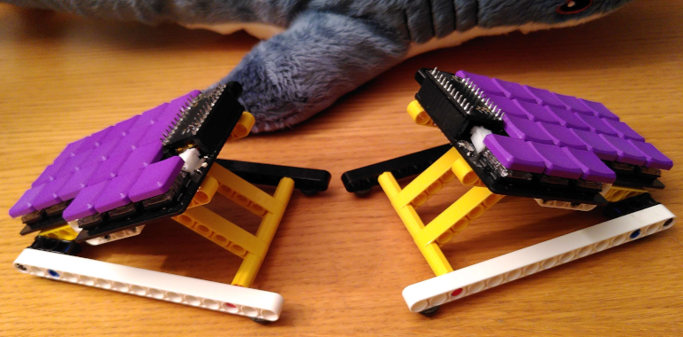

# leko pona

## Related repos
- [ZMK config](https://github.com/CrispyPin/zmk-config/) (layout based on colemak-dh)
- [Ergogen config](https://github.com/CrispyPin/ergogen/) used to generate the pcb

## Parts list
- nice!nano x2
- 12 pin socket strips x4
- JST-PH battery connectors x2
- PCM12 power switch x2
- 3.7V 130mAh battery x2
- choc switches x36
- choc keycaps x36
- choc hotswap sockets x36 (optional)
- rubber feet (optional)

## Notes about assembly
- Solder pads for the reversible footprint should be soldered on the underside of the board if you want the back of the nice!nano facing up (like in the picture)
- The battery connector is slightly asymmetrical on the two halves, it should be clear from the outline on the silkscreen which way to put it
- If your batteries are small enough you can tuck them under the controllers
- You can use a permanent marker to get a clean look on the edges of the pcbs

## LEGO tenting set
[Instructions](lego_tenting.md)

