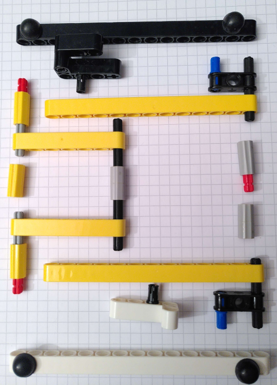
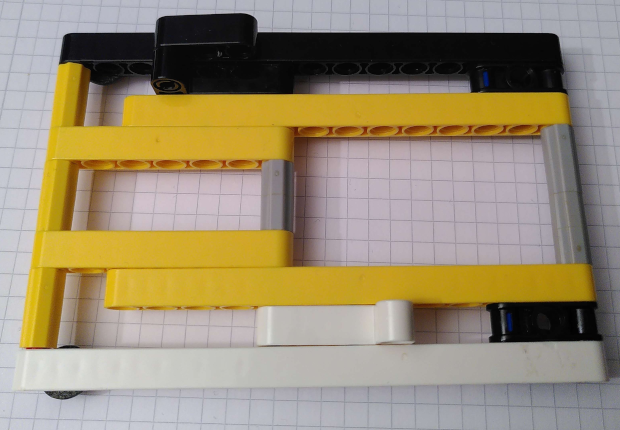
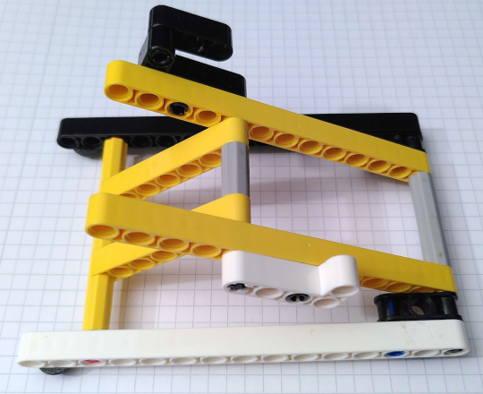

# Lego tenting set for leko pona 1
## Parts
Parts required to build both halves:
- 4x 15u bars
- 4x 13u bars
- 4x 7u bars
- 2x 3u bars
- 4x small L bars
- 6x 2u axles
- 4x 3u axles
- 8x 4u axles
- 12x axle extender
- 6x friction pins
- 4x axle pins
- 4x 3u bars with axle holes
- 8x rubber feet

## Layout
Showing part layout for right tenting stand, repeat mirrored for other half.

